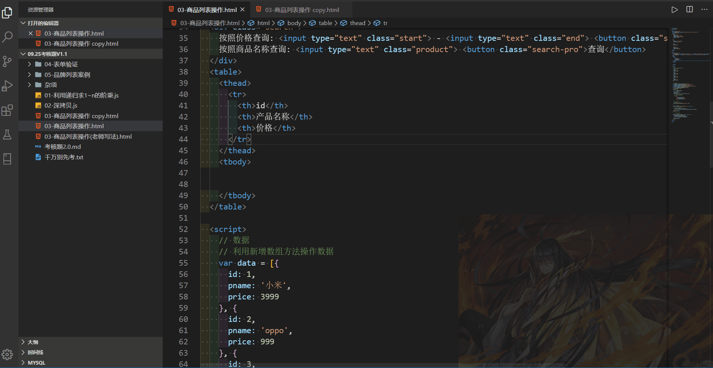
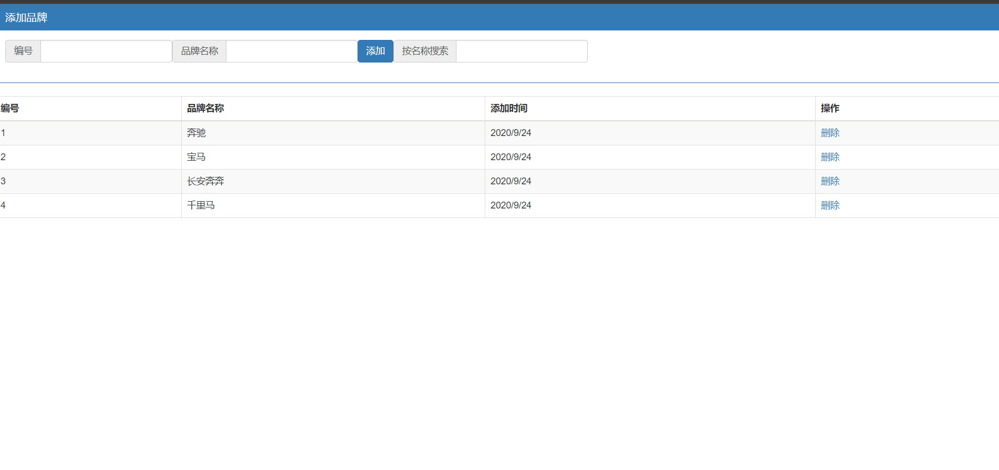

## 考核的时候打开这个md文档开考


## 1.利用递归函数求1~n的阶乘 

```js
// 例: 3!=6 4!=24
```


## 2.深拷贝拷贝多层, 每一级别的数据都会拷贝.

```js
// 例: 新对象和旧对象的内存地址要不一样,一样的算不对
var obj = {
  id: 1,
  name: "andy",
  msg: {
    age: 18,
  },
  color: ["pink", "red"],
};

```


## 3.商品列表操作

数据

```js
 var data = [{
      id: 1,
      pname: '小米',
      price: 3999
    }, {
      id: 2,
      pname: 'oppo',
      price: 999
    }, {
      id: 3,
      pname: '荣耀',
      price: 1299
    }, {
      id: 4,
      pname: '华为',
      price: 1999
    }];
```

要求:

-   完成渲染数据
-   完成按照价格查询功能
-   完成按照商品名称查询功能

效果图



## 4.表单验证

数据

```js
/^1[3|4|5|7|8]\d{9}$/; // 手机号码的正则表达式
/^[1-9]\d{4,}$/; // qq正则表达式
/^[\u4e00-\u9fa5]{2,8}$/; //中文正则表达式
/^\d{6}$/; //短信验证码正则表达式
// 密码正则表达式  自己写(包括大小写字母,下划线,数字,6到16位)
```

```js


## 5.品牌列表

数据

```js
brandlist: [
        {
          id: 1,
          name: "奔驰",
          ctime: new Date().toLocaleDateString(),
        },
        {
          id: 2,
          name: "宝马",
          ctime: new Date().toLocaleDateString(),
        },
        {
          id: 3,
          name: "长安奔奔",
          ctime: new Date().toLocaleDateString(),
        },
        {
          id: 4,
          name: "千里马",
          ctime: new Date().toLocaleDateString(),
        },
      ],
```

要求

-   使用vue写
-   完成数据渲染
-   完成添加功能
    -   编号和品牌都要输入才能添加
-   完成按名称搜索
    -   输入 "奔" 会出现 `奔驰`和`长安奔奔`

-   完成删除功能


效果图  
