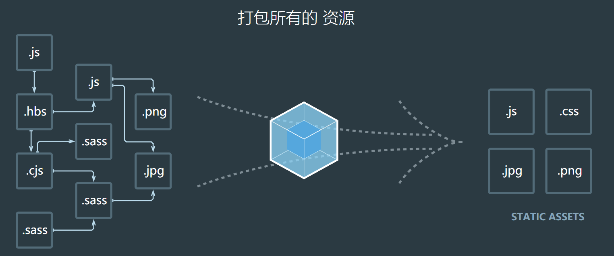
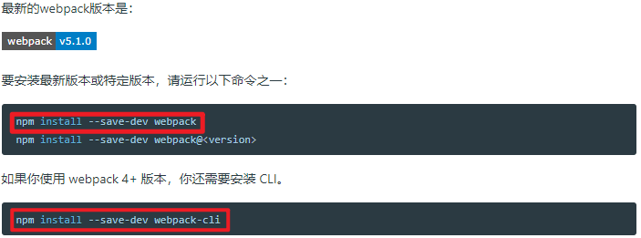

# day09-webpack

## webpack概述

  通过ts、ES6等开发的应用不能直接放到服务器，因为浏览器不解析，那么就可以通过webpack转化生成浏览器可以识别并执行的代码。
  目前市场上的打包工具：rollup、webpack、gulp/grunt

### webpack是什么

  官方解释：webpack是一个现代的JavaScript应用的静态模块打包工具
  也就是说 webpack是一种前端资源构建工具，一个静态模块打包器(module bundler),
  在webpack看来，前端的所有资源文件(js/json/css/img/less/...)都会作为模块处理
  它将根据模块的依赖关系进行静态分析，打包生成对应的静态资源(bundle)
  **一句话，webpack的功能就是模块和打包**

  webpack为了正常运行必须依赖node环境，Node环境为了正常执行很多代码，必须依赖很多包，npm（node packages manager）工具是为了管理Node的包。

## webpack的五个核心概念

### Entry

  入口(entry)指示 webpack以哪个文件为入口起点开始打包，分析构建内部依赖图

### Output

  输出(Output)指示 webpack打包后的资源bundles输出到哪里去，以及如何命名

### Loader

  Loader让webpack能够去处理哪些非JavaScript文件(webpack自身只能理解JavaScript),类似于现实社会中的翻译官角色

### Plugin

  插件(Plugin)可以用于执行范围更广的任务，插件的范围包括，从打包优化和压缩，一直到重新定义环境中的变量等.

### Mode

  模式(Mode)指示webpack使用相应模式的配置

|  选项    | 描述 | 特点 |
| ---- | ---- | ---- |
| development | 会将process.env.NODE_ENV的值设为development，启用NamedChunksPlugin和NamedModulesPlugin | 能让代码本地调式运行的环境 |
| production | 会将process.env.NODE_ENV的值设为production，启用FlagDependencyUsagePlugin，FlagincludeChunksPlugin,ModuleConcatenationPlugin,NoEmitOnErrorsPlugin, OcfurrenceOrderPlugin, SideEffectsFlagPlugin和UglifyJsPlugin | 能让代码优化上线运行的环境 |

## webpack基本使用

### 步骤1:安装webpack及webpack-cli

### 步骤2: 
