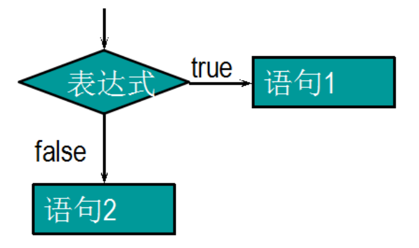

## 条件判断（分支）

> ### 语法

```javascript
//单条件表达式
if(n){语句块} //n会被转成布尔类型
   if ( 条件表达式【布尔类型的结果】 ) { 
       
   	    逻辑代码。。。
       
     }else {
       
         逻辑代码。。。
     } 

//多条件表达式
  if ( 条件表达式 ) {
    
	}else if ( 条件表达式 ) {
    
    }else {
        
    }
```




## switch语句

> ### 语法

```javascript
switch ( 变量 ) {
    case  值1:
        代码语句..
     break;
    case  值2:
        代码语句...
    break;
    default:    
    break;
}
```

> ### 执行过程

```javascript
 总结：
	 1. 如果在程序中要表示一个范围，那么推荐使用条件判断
     2. 如果程序中表示的是一个具体的值， 可以用switch语句
     
  注意：
	//1. switch 后面的变量数据类型必须和 case 后面的值数据类型保持一至
	//2. break语句必须加
```

## 循环

- ### while循环

> ### 语法

```javascript
while(条件表达式) {
    代码（循环体）
}
```

> ### 执行过程

```javascript
 1.  先条件判断结构是 true 还是 false
 2.  如果是true，那么程序会一直执行循环体中的代码
 3.  如果条件为false，那么程序会立即跳出循环体代码结束执行
```

- ### do .. while 循环


> ### 语法

```javascript
do {
    循环体代码
}while(条件表达式)
```

> ### 执行过程

```javascript
 ☞  先执行循环体代码
 ☞ 然后判断条件
 ☞ 如果条件为true，继续执行循环体代码
 ☞ 如果条件为false,循环体代码立即结束，跳出循环


 与while循环的区别：
 	 1. 如果条件不满足，do while循环会比while循环多执行一次
     2. 如果条件满足，do while循环和while循环执行的次数是一样一样的。
```

## for 循环

> ### 语法

```javascript
语法
    ☞  如果能明确循环次数，推荐使用for循环， 如果循环次数不确定，可以使用while获取do while循环
    for(变量初始化;条件判断;变量改变){//循环体}
```

> ### 执行过程

```javascript
1. 先执行变量初始化
2. 条件判断，结构是否为true
3. 如果条件为true，进入循环体中执行代码 【如果条件为false，循环立即结束】
4. 变量自增或自减  --   条件判断   --  true  --- 执行代码
```

## continue和break

> ### continue语句执行及特点

```javascript
立即跳出本次循环，继续下一次循环（本次循环体 continu 之后的 代码 就都少执行这一次）
```

> ### break语句执行及特点

```javascript
 理解跳出整个循环（循环结束），开始执行 循环后面的代码
```

 

